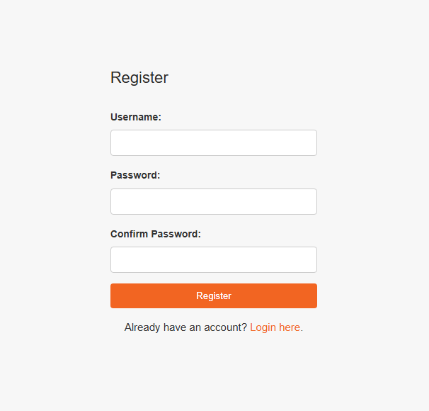
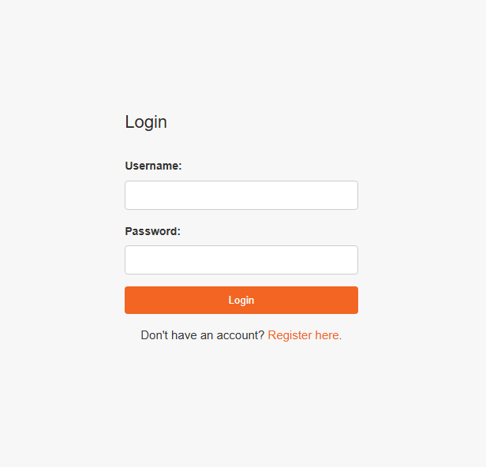
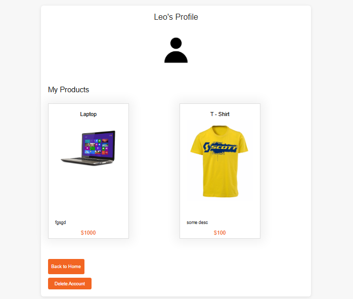
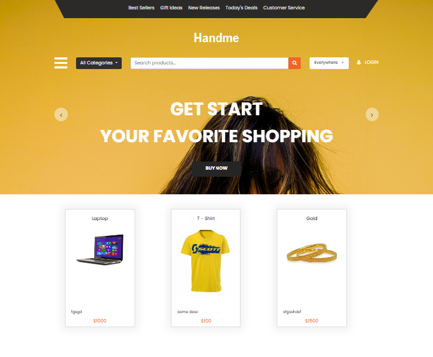
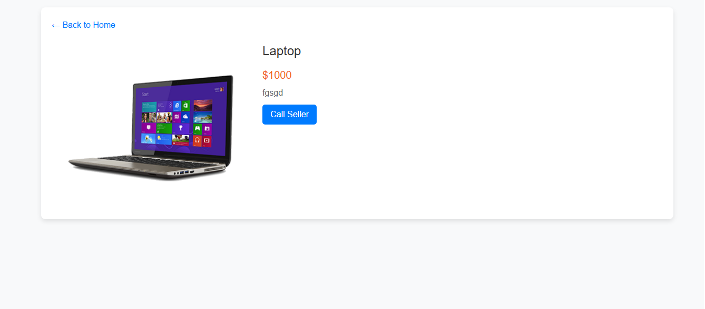
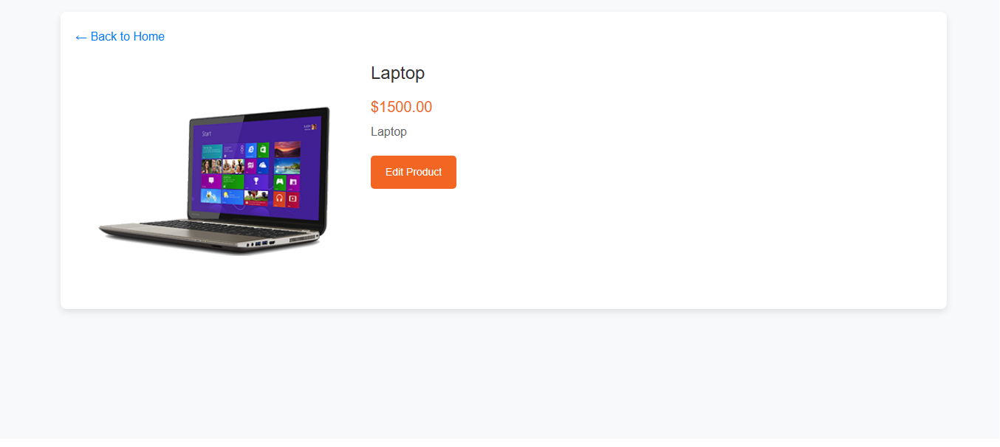
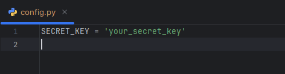

# Handme FastAPI

Handme is a simple replicated shop application from earlier made Django Handme Project built using FastAPI. The project
allows users to register, login, view products, and manage their profiles. It features product listings in a grid layout
with filtering options such as category and location, as well as profile management features for changing profile photos
and deleting accounts.

## Features

- **User Registration & Authentication**: Users can register using a username and password, and the application ensures
  password validation during registration. Users can log in, log out, and manage their sessions using JWT tokens.
  
  
  

- **Profile Management**: Users can view and update their profile information, including changing their profile picture
  or deleting their account.

  

- **Product Listings**: Products are displayed on the main page in a grid layout. Users can filter products by category
  or location, and search for specific products.

  
  

- **Product Management**: Each product has its own detail page, allowing users to either contact the seller or edit the
  product if they are the creator.

  
  

## Getting Started

### Prerequisites

- Python 3.9 or higher
- PostgreSQL

### Installation

1. Clone the repository:
   ```sh
   git clone https://github.com/savinleonid/Handme_FastAPI.git
   ```

2. Navigate to the project directory:
   ```sh
   cd Handme_FastAPI
   ```

3. Create a virtual environment:
   ```sh
   python -m venv .venv
   ```

4. Activate the virtual environment:
    - On Windows:
      ```sh
      .venv\Scripts\activate
      ```
    - On Unix or MacOS:
      ```sh
      source .venv/bin/activate
      ```

5. Install the required packages:
   ```sh
   pip install -r requirements.txt
   ```

6. Set up the database:
    - Make sure PostgreSQL is installed and running.
    - Create config file in project root folder with your secret key.
      
    - Create a new database and change postgresql credentials in app/database.py and alembic.ini after
      first migration.

7. Apply migrations:
8. ```sh
   alembic init alembic
   ```
   ```sh
   alembic revision --autogenerate -m "Initial migration"
   ```
   ```sh
   alembic upgrade head
   ```

8. Run the development server:
   ```sh
   uvicorn app.main:app --reload
   ```

### Configuration

- **Database Configuration**: Update the PostgreSQL connection details in the `.env` file.
- **Profile Picture Default**: The default profile picture is located at `app/static/media/profile_pics/default.png`.

## Usage

- Navigate to `http://127.0.0.1:8000` to access the application.
- You can register a new account, log in, and explore the features, such as viewing products and managing your profile.

## Project Structure

- `app/` - Main application folder containing models, routers, and templates.
- `app/static/` - Static files, such as profile pictures.
- `app/templates/` - HTML templates for rendering views.
- `alembic/` - Folder containing migration scripts.

## Future Improvements

- Add functionality for users to leave reviews for products.
- Add pagination
- Enhance the filtering capabilities to include price range and rating.
- Implement email verification during registration.

## Contributing

If you'd like to contribute, feel free to fork the repository and submit a pull request. For major changes, please open
an issue first to discuss what you would like to change.

## License

This project is licensed under the MIT License - see the LICENSE file for details.

